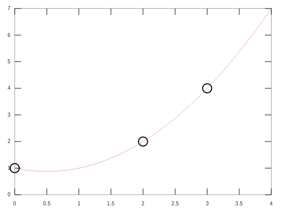

# 数值分析 Matlab/Octave代码
## 第0章 基础知识（nest.m）
#### 程序0.1 嵌套乘法：
* 使用霍纳方法计算
* 调用示例：
```
    nest(4,[-1 5 -3 3 2],1/2)
```
* 最终结果： 
```
    ans =  1.2500
```
## 第1章 求解方程  (bisect.m  fpi.m  f.m)
#### 程序1.1 二分法 
* 调用示例：
```
    f = @(x) x^3+x-1
    xc = bisect(f,0,1,0.00005)
```
* 最终结果：
```
    xc =  0.68234
```
#### 程序1.2 不动点迭代 
* 调用示例：
```
    g = @(x) (1+2.*x^3)/(1+3.*x^2)
    xc = fpi(g,0.5,10)
```
* 最终结果：
```
    xc =  0.68233
```
#### 事实验证1 Stewart平台运动学

* Stewart平台运动学

> 参数意义：
> p1\p2\p3为臂长
> v\L1\L2\L3定义三角形的形状(等腰直角）
> x1/x2/y2定义支杆位置

* 使用方法：
```
    theta = -pi:0.05:pi;
    fx = f(theta);
    plot(theta,fx)
    grid on
```

* 结果：
```
    解为pi/4和-pi/4
```


## 第2章 方程组 (Euler_Bernoulli.m)


## 第3章 插值 (newtdd.m  clickinterp.m)
#### 程序3.1 牛顿差商插值方法
* 调用示例
```
    x0 = [0 2 3]
    y0 = [1 2 4]
    c = newtdd(x0,y0,3);
    x = 0:0.01:4
    y = nest(2,c,x,x0)
    plot(x0,y0,'o',x,y)
```



